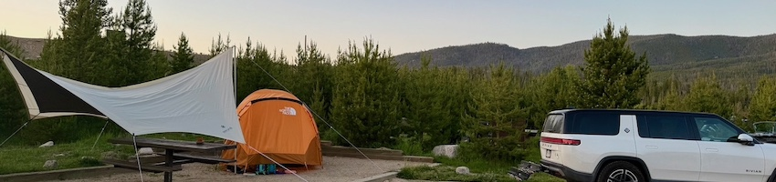

# Hi, I'm Patrick!

## Software Engineer | Tech Enthusiast | :heart: Outdoors

From hacking early websites in the 90s to leading engineering today, I’ve spent 20+ years building web and cloud systems that scale. I hold a BSc in Computer Science in Media (Furtwangen, DE) and an MSc in Media Technology (Leiden, NL), co‑founded several companies and communities, and ran an Estonian e‑Residency consultancy while traveling as a digital nomad through Europe and Asia. Now settled in Boulder, Colorado, I lead software at Nevados, channeling that broad journey into tools & automations for climate and clean energy impact. In my free time I soak up the Rockies with my family - hiking, mountain biking, snowboarding and camping.

### Find me online

- [Book a meeting](https://cal.com/zentered/30min)
- [Personal Website](https://patrickheneise.com)
- [Zentered Website](https://zentered.co)
- [BlueSky Social](https://bsky.app/profile/patrickheneise.com)
- [LinkedIn](https://www.linkedin.com/in/patrickheneise/)

### Life Stats

|                                                |                                                |                                           |
| ---------------------------------------------- | ---------------------------------------------- | ----------------------------------------- |
| :world_map: 42 countries visited               | :partying_face: 6 countries lived in           | :man_technologist: 60+ projects worked on |
| :building_construction: 5 companies co-founded | :busts_in_silhouette: 7 communities co-founded | :heart_hands: 6 conferences organized     |
